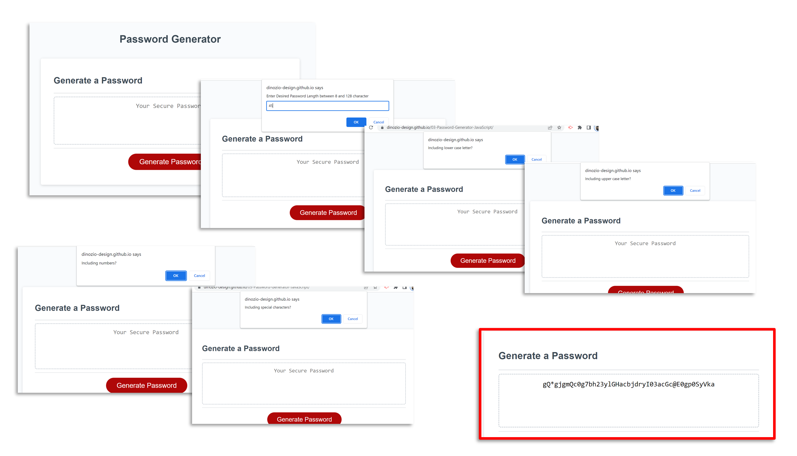

# 03 - Password Generator | JavaScript
### On-the-job ticket
<br>

## Description

In this week's Challenge! I modified starter code to create an application that enables employees to generate random passwords based on criteria that they’ve selected. This app will run in the browser and will feature dynamically updated HTML and CSS powered by JavaScript code. It will have a clean and polished, responsive user interface that adapts to multiple screen sizes.The password can include special characters.

To achieve this task, I used some elementary JavaScript code such as:
-	Creating objects to clean-up the code;
-	Creating functions to facilitate the flow;
-	Use the internal prompt(), alert(), and confirm() functions;
-	Implement IF conditions and Comparison Operators to validate user input;
-	Combine arithmetic and iteration loops to compile string output; and
-	Use object methods to target specific variables.


> To begin with, I started with a draft pseudo code<br><br>
 


## User Story

```
AS AN employee with access to sensitive data
I WANT to randomly generate a password that meets certain criteria
SO THAT I can create a strong password that provides greater security
```

## Acceptance Criteria

```
GIVEN I need a new, secure password
WHEN I click the button to generate a password
THEN I am presented with a series of prompts for password criteria [DONE]
WHEN prompted for password criteria
THEN I select which criteria to include in the password [DONE]
WHEN prompted for the length of the password
THEN I choose a length of at least 8 characters and no more than 128 characters [DONE]
WHEN asked for character types to include in the password
THEN I confirm whether or not to include lowercase, uppercase, numeric, and/or special characters [DONE]
WHEN I answer each prompt
THEN my input should be validated and at least one character type should be selected [DONE]
WHEN all prompts are answered
THEN a password is generated that matches the selected criteria [DONE]
WHEN the password is generated
THEN the password is either displayed in an alert or written to the page [DONE]
``` 

## Mock-Up

> The following image shows the proposed web application's appearance and functionality:


## My Work
At fist I wanted to use the `<dialog>` element to interact with (and collect input from) the user. However I decided to use the quicker and simpler `prompt()` family of functions. I broke it down to individual buckets and started writing code snippets to test the functionality. I used console.log() at every steps and tweaked the code to debug. Once I was comfortable with the functionality, I went back to my draft pseudo code and restructured it based on the flow. I then decided to used Objects more pragmatically, and managed to write a somewhat clean code. I still would like to clear the textbox after each click…perhaps in the next revision and deployment!


### My Initial PseudoCode
```
    click
    const   pwIndexArray ["a"-"z", "A"-"Z", "0"-"9", specialChar]
                   index [0-25 | 26-51 | 52-61 | 62 to 69]
    var pWord
    prompt : choose length from list of [8 to 128]
        validate: no less than 8, no more than 128
        validate: Number(myNumber)
        set variable pwLength
    prompt : choose types from list of [lowerCase, upperCase, nums, spChars]
        validate: choose at lease 1
        validate: can choose more than 1
        set variable pwIndexRange
    defind function pGen(){
        var RAND call Math(pwIndexRange)
        pWord += pwIndexArray[RAND]
    }
    do {
        call pGen()
    } while (pWord.length < pwLength)

    output onto html : pWord

```

### Deployed Links

1. You can find the URL of my deployed application **here:** <br>[03-Password-Generator-JavaScript - link](https://dinozio-design.github.io/03-Password-Generator-JavaScript/)

2. You can find the URL of my GitHub repository that contains this code **here:** <br>[GitHub Repo - link](https://github.com/dinozio-design/03-Password-Generator-JavaScript)

### Images of my App
> The following image shows the my actual web application's appearance and functionality:



## References
I used files and resources provided by BCS : GitLab repo UTOR-VIRT-FSF-PT-04-2023-U-LOLC


- - -
### Authors Notes:<br>
_This README and accompanying repo have been brought to you by:_<br>
© Sam Azimi - 2023 CodeCamp Studen.<br> 
Confidential and Proprietary. All Rights Reserved.
